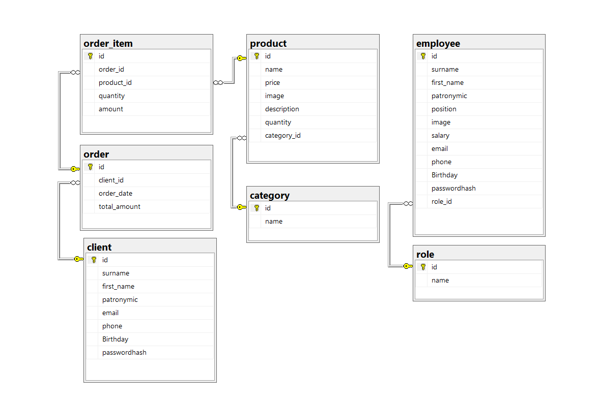
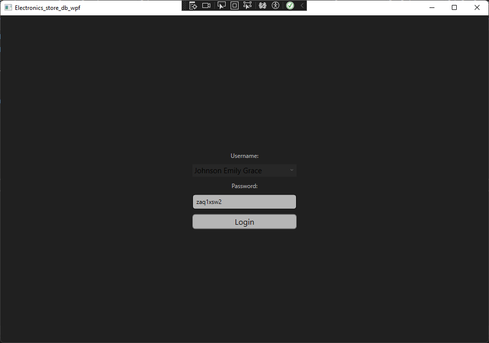
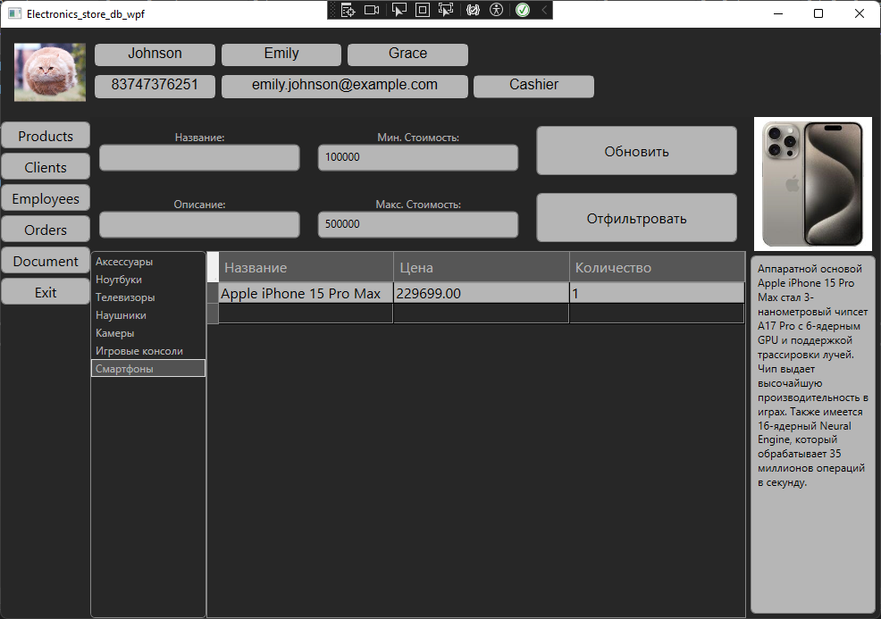
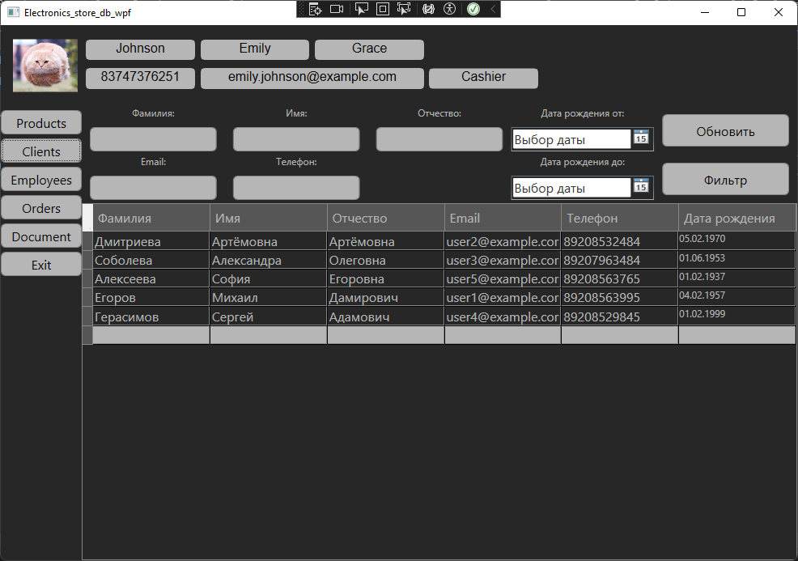
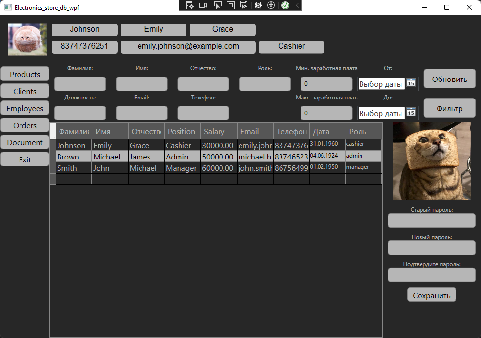
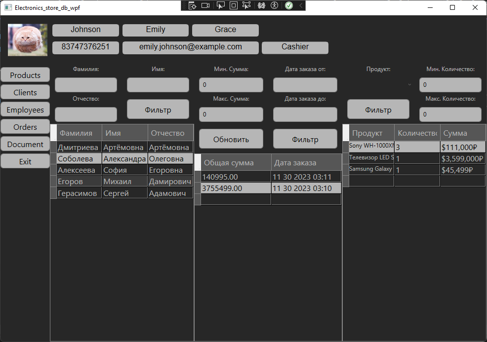
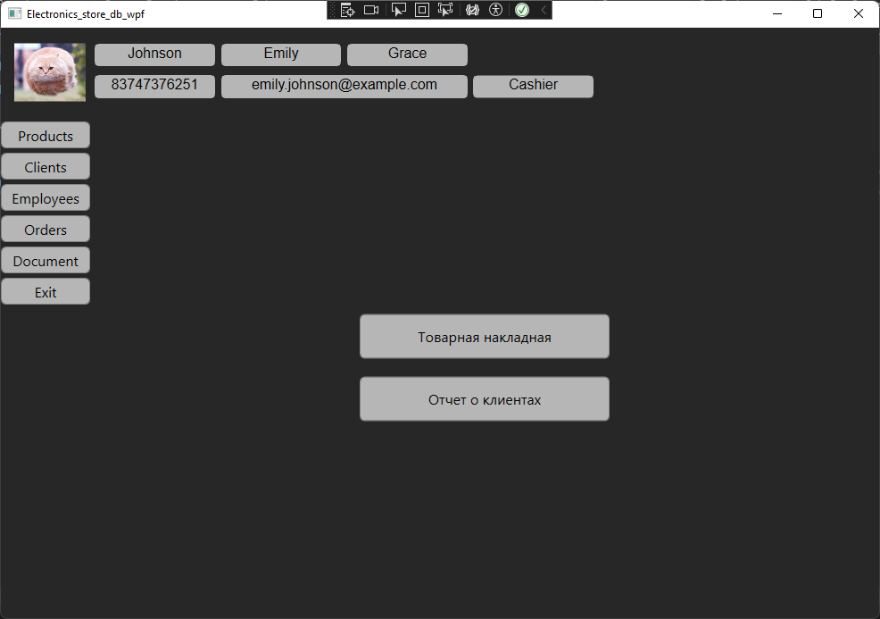

# WPF приложение для управления данными магазина электроники

## Описание проекта

Приложение создано с целью изучения и практического освоения технологий **WPF**, **.NET**, **Entity Framework Core**, **MS SQL**, а также паттернов проектирования **MVVM** и **Dependency Injection**. Основной функционал включает аутентификацию пользователей, просмотр данных с возможностью фильтрации, а также экспорт данных в Excel.

## Основные функции

- **Авторизация**  
  Поддержка аутентификации для заранее созданных пользователей, добавленных в базу данных с помощью SQL-запросов.

- **Просмотр данных**  
  Доступ к информации о продуктах, клиентах, сотрудниках и заказах. Для удобства данные можно фильтровать по различным критериям.

- **Экспорт данных**  
  Возможность сохранять данные в формате Excel для создания товарных накладных и отчетности по клиентам.

## Технологии

- **WPF** (Windows Presentation Foundation) — для разработки пользовательского интерфейса.
- **.NET** — платформа для создания приложения.
- **Entity Framework Core** — ORM для работы с базой данных.
- **MS SQL** — система управления базами данных.

## Архитектурные паттерны

- **MVVM** (Model-View-ViewModel) — для структурирования кода и логики приложения.
- **Dependency Injection** — для облегчения тестирования и упрощения взаимодействия между компонентами.

## Диаграмма базы данных

Приложение использует структуру базы данных, оптимизированную для хранения информации о продуктах, клиентах, сотрудниках и заказах. Ниже представлена схема базы данных:  

## Интерфейс приложения

Основные разделы приложения включают:

1. **Экран aутентификации** — ввод пароля уже созданного пользователя.  
   
2. **Раздел продуктов** — просмотр и фильтрация списка товаров, включая подробности о характеристиках и наличии.  
   
3. **Раздел клиентов** — данные о клиентах с возможностью фильтрации по различным критериям.  
   
4. **Раздел сотрудников** — информация о сотрудниках магазина.  
   
5. **Раздел заказов** — просмотр информации о заказах.  
   
6. **Раздел документов** — создание отчета или товарной накладной в Excel файле.  
   

### Пароли:
user: `Johnson Emily Grace` password: `zaq1xsw2`  
user: `Brown Michael James` password: `1234qw`  
user: `Smith John Michael` password: `qwerty1234`  

---

**Дата создания**: 29 ноябрь 2023 г.
